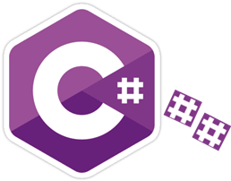
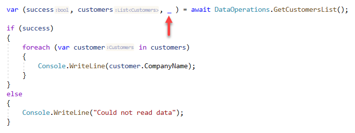

# The art of Deconstructing

## Basics

The following shows different ways to return data from a method.

In conventional coding returning information typically looks like the following which is devoid of any exception handling.

```csharp
public class DataOperations
{
    public static async Task<List<Customers>> GetCustomersList()
    {
        await using NorthContext context = new();
        return await context
            .Customers
            .Include(c => c.ContactTypeIdentifierNavigation)
            .ToListAsync();
    }
}
```

But we all know that at anytime an exception may be thrown, in the above case perhaps the server where the database resides is not available.

So what can be done? Write to a log file and return `null` when an exception is thrown.

```csharp
public class DataOperations
{
    public static async Task<List<Customers>> GetCustomersList()
    {
        try
        {
            await using NorthContext context = new();
            return await context
                .Customers
                .Include(c => c.ContactTypeIdentifierNavigation)
                .ToListAsync();
        }
        catch (Exception ex)
        {
            // write to error log
            return null;
        }
    }
}
```

The above although works is not a nice solution, let's try using deconstruction.

```csharp
public class DataOperations
{
    public static async Task<(List<Customers> customers, Exception exception)> GetCustomersList()
    {
        try
        {
            await using NorthContext context = new();
            return 
                (
                    await context.
                        Customers
                        .Include(c => c.ContactTypeIdentifierNavigation)
                        .ToListAsync(), 
                    null
                );
        }
        catch (Exception ex)
        {
            // write to error log
            return (null, ex);
        }
    }
}
```

Usage

```csharp
var (customers, exception) = await DataOperations.GetCustomersList();
if (exception is null)
{
    // use customers
}
else
{
    // we have an exception object to see what happened
}
```

In this case we have returned either a list of customers and null or null and an exception.

Can we do better? Yes and no, it depends on your programming style. Here an the first value is a bool which represents success or failure.

```csharp
public class DataOperations
{
    public static async Task<(bool success, List<Customers> customers, Exception exception)> GetCustomersList()
    {
        try
        {
            await using NorthContext context = new();
            return 
                (
                    true,
                    await context.
                        Customers
                        .Include(c => c.ContactTypeIdentifierNavigation)
                        .ToListAsync(), 
                    null
                );
        }
        catch (Exception ex)
        {
            // write to error log
            return (false,null, ex);
        }
    }
}
```

Personally, it's clearer adding the bool.

```csharp
var (success, customers, exception) = await DataOperations.GetCustomersList();
if (success)
{
    // use customers
}
else
{
    // check out exception
}
```

Each of the above examples perform the same operations with varying ways to return data. The first should be avoided unless it’s never going to fail. To be honest, the second is what an uneducated coder might come up with and is not recommended. The final two are personal choices along with showing we can return information and name them like local variables.

Suppose we want to simply check success and not access the exception in regards to the last example? We can use a [discard](https://docs.microsoft.com/en-us/dotnet/csharp/fundamentals/functional/discards).




# Deconstructing non-tuples for classes/models 

This feature is great, but it is actually not limited to just tuples - you can add deconstructors to all your classes. Using the following syntax we can return and deconstruct only the information needed for an operation. The benefit is not needing to return all properties of a model and that there may be several different operations needing different sets of data.

```csharp
public class PersonEntity
{
    public int PersonID { get; set; }
    public string FirstName { get; set; }
    public string LastName { get; set; }
    public string FullName => $"{FirstName} {LastName}";
    public ICollection<StudentGrade> Grades { get; set; }
    public override string ToString() => $"{FirstName} {LastName}";

    public void Deconstruct(out int id, out string firstName, out string lastName)
    {
        id = PersonID;
        firstName = FirstName;
        lastName = LastName;
    }
    public void Deconstruct(out int id, out string fullName)
    {
        id = PersonID;
        fullName = FullName;
    }
    public void Deconstruct(out int id, out string firstName, string lastName, ICollection<StudentGrade> grades)
    {
        id = PersonID;
        firstName = FirstName;
        lastName = LastName;
        grades =Grades;
    }
}
```

Usage using a discard which means we don't want first name, only the primary key and last name.

```csharp
var (id, _, last) = (PersonEntity)SomeControl.SelectedItem;
```

Caveat, the above can only be done with classes you have access too. Suppose there is a class you don't have source code too? The solution is to create a language extension.

Here is a model in a third party library

```csharp

namespace SomeThirdPartyLibrary.Classes
{
    public class Customer
    {
        public int CustomerIdentifier { get; set; }
        public string CompanyName { get; set; }
        public int? ContactId { get; set; }
        public string Street { get; set; }
        public string City { get; set; }
        public string PostalCode { get; set; }
        public int? CountryIdentifier { get; set; }
        public override string ToString() => CompanyName;
    }
}
```

In your project we create an extension method for `Customer`.

```csharp
using SomeThirdPartyLibrary.Classes;

namespace DeconstructCodeSamples.Extensions
{
    public static class ThirdPartyExtensions
    {
        /// <summary>
        ///  Extension for third party class
        /// </summary>
        /// <param name="customer"></param>
        /// <param name="id">customer key</param>
        /// <param name="companyName">customer's company name</param>
        /// <param name="contactIdentifier">customer's contact identifier</param>
        /// <param name="countryIdentifier">country identifier for customer</param>
        public static void Deconstruct(this Customer customer, out int id, out string companyName, out int? contactIdentifier, out int? countryIdentifier)
        {
            id = customer.CustomerIdentifier;
            companyName = customer.CompanyName;
            contactIdentifier = customer.ContactId;
            countryIdentifier = customer.CountryIdentifier;
        }
    }
}
```

# Deconstucting other code

Let's look at a simple dictionary

```csharp
var peopleDictionary = new Dictionary<string, int>
{
    ["Mary"] = 32, 
    ["Frank"] = 17
};
```

Convental method to iterate the key and values.

```csharp
foreach (var pair in peopleDictionary)
{
    Console.WriteLine($"{pair.Key} is {pair.Value} years old");
}
```

Minor issue when looking at the code is say the dictionary definition is not visible, it can be difficult to tell what key and value are, and in a little bit I will drive this home with a more complex example using a switch and grouping.

Next level, deconstruct and provide meaningful variable names.

```csharp
foreach (var (name, age) in peopleDictionary)
{
    Console.WriteLine($"{name} is {age} years old");
}
```

The above is easy to understand. Now for those who like the cool factor here you go.

```csharp
foreach (var (name, age) in peopleDictionary.Select(x => (x.Key, x.Value)))
{
    Console.WriteLine($"{name} is {age} years old.");
}
```

:question: Which to use? the second example, it's clear and easy to read.


# Notes

- If using a framework prior to 4.8, you will need the following NuGet package [System.ValueTuple](https://www.nuget.org/packages/System.ValueTuple), otherwise the package is included in new projects


